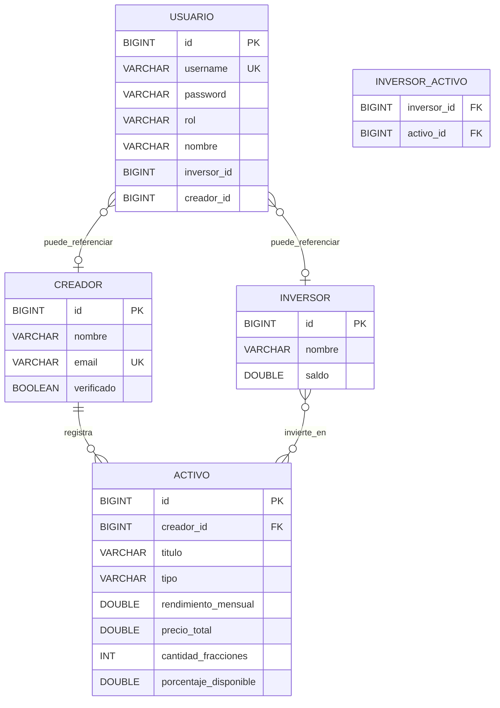

# Mlooker

API REST en **Spring Boot** y frontend **React (Vite)** para un marketplace de **trading de regalías musicales**.

La plataforma conecta **creadores verificados** que publican obras tokenizadas e **inversores** que compran y venden fracciones para recibir retornos proporcionales.

| Módulo | Descripción |
|--------|-------------|
| [`api/`](api/) | API REST Spring Boot 4 + JPA + MySQL |
| [`web/`](web/) | Dashboard React con marketplace, wallet e inversión |
| [`docs/`](docs/) | Diagrama ER y guía de arranque local |

---

## Modelo de dominio

### Entidades principales

- **Creador**: artista o titular de derechos. Publica activos en el marketplace. Puede estar **verificado** (`verificado = true`).
- **Activo**: obra tokenizable (canción `MUSICA` o álbum `ALBUM`) asociada a un creador. Se divide en fracciones (tokens).
- **Inversor**: usuario con saldo en euros que compra participaciones en activos.
- **Usuario**: cuenta de acceso con rol (`INVERSOR` o `CREADOR`) vinculada opcionalmente a un inversor o creador.

### Relaciones

- `Creador (1) → (N) Activo` — un creador registra muchas obras.
- `Inversor (N) ↔ (M) Activo` — tabla intermedia `inversor_activo` (JPA `@ManyToMany`).
- `Usuario` referencia `inversorId` o `creadorId` según el rol.

### Reglas de negocio relevantes

- Cada token representa `100 / cantidadFracciones` % del activo.
- `porcentajeDisponible` en `activos` baja al invertir y sube al vender.
- Solo creadores **verificados** pueden publicar o eliminar sus obras.
- No se puede eliminar una obra con inversores vinculados.

---

## Diagrama ER (implementación actual)



Diagrama ampliado en [`docs/er-diagrama-mlooker.md`](docs/er-diagrama-mlooker.md).

---

## Endpoints REST (`/api/v1`)

Prefijo base: `http://localhost:8080/api/v1`

### Autenticación

| Método | Endpoint | Acceso | Descripción |
|--------|----------|--------|-------------|
| `POST` | `/auth/login` | Público | Login con `username` y `password`. Devuelve JWT. |
| `GET` | `/auth/me` | JWT | Usuario autenticado (rol, `creadorId`, `inversorId`). |

### Creadores

| Método | Endpoint | Acceso | Descripción |
|--------|----------|--------|-------------|
| `GET` | `/creadores` | Público | Listar creadores |
| `GET` | `/creadores/{id}` | Público | Obtener creador por ID |
| `POST` | `/creadores` | Autenticado | Crear creador |
| `PUT` | `/creadores/{id}` | Autenticado | Actualizar creador |
| `DELETE` | `/creadores/{id}` | Autenticado | Eliminar creador |
| `GET` | `/creadores/{id}/activos` | `ROLE_CREADOR` | Mis obras publicadas |
| `POST` | `/creadores/{id}/activos` | `ROLE_CREADOR` verificado | Publicar obra (`PublicarActivoRequest`) |
| `DELETE` | `/creadores/{id}/activos/{activoId}` | `ROLE_CREADOR` verificado | Eliminar obra (sin inversores) |

### Activos

| Método | Endpoint | Acceso | Descripción |
|--------|----------|--------|-------------|
| `GET` | `/activos` | Público | Listar activos del marketplace |
| `GET` | `/activos/buscar?tipo=&rendimientoMinimo=` | Público | Búsqueda filtrada (JPQL) |
| `GET` | `/activos/{id}` | Público | Detalle de un activo |
| `POST` | `/activos` | Autenticado | Crear activo |
| `PUT` | `/activos/{id}` | Autenticado | Actualizar activo |
| `DELETE` | `/activos/{id}` | Autenticado | Eliminar activo |

### Inversores

| Método | Endpoint | Acceso | Descripción |
|--------|----------|--------|-------------|
| `GET` | `/inversores` | Público* | Listar inversores |
| `GET` | `/inversores/{id}` | JWT (propio) | Saldo y datos del inversor |
| `GET` | `/inversores/{id}/regalias-total` | JWT (propio) | Total de regalías acumuladas |
| `POST` | `/inversores/{id}/invertir` | `ROLE_INVERSOR` | Comprar tokens (`activoId`, `importe`) |
| `POST` | `/inversores/{id}/vender` | `ROLE_INVERSOR` | Vender tokens (`activoId`, `importe`) |
| `POST` | `/inversores` | Autenticado | Crear inversor |
| `PUT` | `/inversores/{id}` | Autenticado | Actualizar inversor |
| `DELETE` | `/inversores/{id}` | Autenticado | Eliminar inversor |

\* El listado de inversores es público en lectura; operaciones de cartera requieren JWT.

### Otros

| Método | Endpoint | Descripción |
|--------|----------|-------------|
| `GET` | `/health` | Estado del servicio |

---

## Diseño de tablas (MySQL)

Hibernate crea/actualiza el esquema con `spring.jpa.hibernate.ddl-auto=update` en perfil `local`.

### `creadores`

| Columna | Tipo | Notas |
|---------|------|-------|
| `id` | BIGINT PK AUTO_INCREMENT | |
| `nombre` | VARCHAR NOT NULL | Nombre artístico |
| `email` | VARCHAR NOT NULL UNIQUE | |
| `verificado` | BOOLEAN NOT NULL | Solo verificados publican |

### `activos`

| Columna | Tipo | Notas |
|---------|------|-------|
| `id` | BIGINT PK AUTO_INCREMENT | |
| `creador_id` | BIGINT FK → `creadores.id` | Índice recomendado |
| `titulo` | VARCHAR NOT NULL | Nombre de la obra |
| `tipo` | VARCHAR NOT NULL | `MUSICA` o `ALBUM` |
| `rendimiento_mensual` | DOUBLE NOT NULL | Regalías estimadas |
| `precio_total` | DOUBLE NOT NULL | Valor total tokenizado |
| `cantidad_fracciones` | INT NOT NULL | Número de tokens |
| `porcentaje_disponible` | DOUBLE NOT NULL | % aún en venta (0–100) |

### `inversores`

| Columna | Tipo | Notas |
|---------|------|-------|
| `id` | BIGINT PK AUTO_INCREMENT | |
| `nombre` | VARCHAR NOT NULL | |
| `saldo` | DOUBLE NOT NULL | Saldo en EUR |

### `inversor_activo` (N:M)

| Columna | Tipo | Notas |
|---------|------|-------|
| `inversor_id` | BIGINT FK → `inversores.id` | PK compuesta |
| `activo_id` | BIGINT FK → `activos.id` | PK compuesta |

### `usuarios`

| Columna | Tipo | Notas |
|---------|------|-------|
| `id` | BIGINT PK AUTO_INCREMENT | |
| `username` | VARCHAR NOT NULL UNIQUE | Login |
| `password` | VARCHAR NOT NULL | BCrypt |
| `rol` | VARCHAR NOT NULL | `INVERSOR` o `CREADOR` |
| `nombre` | VARCHAR NOT NULL | Nombre visible |
| `inversor_id` | BIGINT NULL | Si rol inversor |
| `creador_id` | BIGINT NULL | Si rol creador |

---

## Seguridad

- **JWT** en cabecera `Authorization: Bearer <token>` (login en `/api/v1/auth/login`).
- **Basic Auth** y **API Key** (`X-API-Key`) siguen disponibles para herramientas y pruebas.
- Lectura del marketplace (`GET /activos`, `GET /creadores`) es **pública**.
- Invertir, vender, publicar y borrar obras requieren JWT con el rol adecuado.

---

## Usuarios demo (perfil `local`)

Contraseña = mismo valor que el usuario.

| Usuario | Rol | Descripción |
|---------|-----|-------------|
| `cliente` | Inversor | Wallet para comprar/vender tokens |
| `quevedo` | Creador verificado | Artista demo |
| `lapantera` | Creador verificado | Artista demo |
| `luchork` | Creador verificado | Artista demo |
| `rosalia` | Creador verificado | Artista demo |
| `badbunny` | Creador verificado | Artista demo |
| `drake` | Creador verificado | Artista demo |
| `taylorswift` | Creador verificado | Artista demo |
| `billieeilish` | Creador verificado | Artista demo |
| `shakira` | Creador verificado | Artista demo |
| `eminem` | Creador verificado | Artista demo |

Con la BD vacía, `DemoDataLoader` crea obras de Quevedo, La Pantera y Lucho RK. `AuthDataLoader` crea usuarios y marca creadores como verificados.

---

## Arranque local

Guía detallada para el equipo: [`docs/SETUP-LOCAL.md`](docs/SETUP-LOCAL.md).

### Requisitos

- Java 17+
- MySQL 8 (puerto 3306)
- Node.js 18+ (frontend)

### API (puerto 8080)

```powershell
cd api\src\main\resources
copy application-local.properties.example application-local.properties
# Editar application-local.properties con tu contraseña MySQL

cd ..\..\..
.\mvnw.cmd spring-boot:run
```

### Frontend (puerto 5173)

```powershell
cd web
copy .env.example .env
npm install
npm run dev
```

Abrir http://localhost:5173 — el marketplace consume `GET /api/v1/activos`. Invertir y vender piden login como inversor; publicar obras, como artista verificado.

### Comprobaciones

- http://localhost:8080/health
- http://localhost:8080/api/v1/activos
- http://localhost:8080/api/v1/creadores

**No commitear** `application-local.properties`, `run-local.ps1` ni `web/.env`.

---

## Frontend (`web/`)

- **Marketplace público**: listado de obras con foto del artista verificado.
- **Detalle de activo**: gráfica de mercado, compra/venta de tokens (requiere login).
- **Wallet**: saldo y regalías (solo inversor autenticado).
- **Panel creador**: publicar y eliminar obras (solo creador verificado).

Variables: `VITE_API_URL=http://localhost:8080` en `web/.env`.

---

## Stack técnico

| Capa | Tecnología |
|------|------------|
| API | Spring Boot 4, Spring Security, JWT, JPA/Hibernate, MySQL |
| Validación | Jakarta Validation + `@ControllerAdvice` |
| Frontend | React 19, Vite, Axios, Recharts, Tailwind CSS |
| Tests | JUnit 5, Spring Boot Test |
