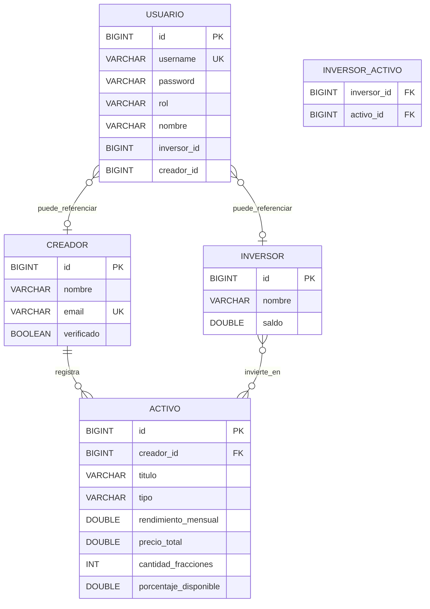

# Mlooker

Marketplace de **trading de regalías musicales** con API REST en **Spring Boot** y frontend **React (Vite)**.

Los **creadores verificados** publican obras tokenizadas; los **inversores** compran y venden fracciones (tokens) para recibir retornos proporcionales.

**Proyecto UT6** — persistencia JPA, relaciones, CRUD, búsqueda, seguridad y validación.

| Módulo | Descripción |
|--------|-------------|
| [`api/`](api/) | API REST Spring Boot 4 + JPA + MySQL |
| [`web/`](web/) | Marketplace React, wallet, panel creador |
| [`docs/`](docs/) | Diagrama ER, guía local y scripts SQL |

---

## Autores

- Alejandro Acosta Arencibia
- Damian

---

## Requisitos previos

| Herramienta | Versión |
|-------------|---------|
| Java | 17+ |
| MySQL | 8.x (puerto 3306) |
| Node.js | 18+ (solo frontend) |
| Maven | Incluido (`api/mvnw`) |

---

## Arranque rápido

### 1. API (puerto 8080)

```powershell
cd api\src\main\resources
copy application-local.properties.example application-local.properties
```

Edita `application-local.properties` y sustituye `PON_TU_PASSWORD_MYSQL` por tu contraseña MySQL.

```powershell
cd ..\..\..
.\mvnw.cmd spring-boot:run
```

### 2. Frontend (puerto 5173)

```powershell
cd web
copy .env.example .env
npm install
npm run dev
```

Abre **http://localhost:5173**

Guía ampliada del equipo: [`docs/SETUP-LOCAL.md`](docs/SETUP-LOCAL.md).

### Comprobaciones

| URL | Qué verifica |
|-----|----------------|
| http://localhost:8080/health | API en marcha |
| http://localhost:8080/api/v1/activos | Marketplace (público) |
| http://localhost:8080/swagger-ui.html | Documentación OpenAPI |
| http://localhost:5173 | Frontend |

### Tests API

```powershell
cd api
.\mvnw.cmd test
```

### Archivos que no deben subirse a Git

- `api/src/main/resources/application-local.properties`
- `api/run-local.ps1` (si lo creáis desde el `.example`)
- `web/.env`

---

## Arquitectura

```
Controller  →  Service  →  Repository  →  MySQL
     ↑            ↑
   DTOs      Reglas de negocio
```

- Los **controladores** solo gestionan HTTP y delegan en servicios.
- Los **servicios** contienen la lógica (invertir, publicar, búsquedas, regalías).
- Los **repositorios** extienden `JpaRepository` y declaran consultas derivadas o `@Query`.
- El controlador **nunca** accede al repositorio directamente.
- `findById()` devuelve `Optional<T>` y en el controlador se usa `.map().orElse(notFound())`.

---

## Modelo de dominio

### Entidades JPA

| Entidad | Descripción |
|---------|-------------|
| **Creador** | Artista o titular de derechos. Campo `verificado` controla el panel de publicación. |
| **Activo** | Obra tokenizable (`MUSICA` o `ALBUM`) con precio total, fracciones y % disponible. |
| **Inversor** | Usuario con saldo en EUR que compra participaciones. |
| **Usuario** | Cuenta de acceso (`INVERSOR` o `CREADOR`) vinculada a inversor o creador. |

### Relaciones

| Relación | Cardinalidad | Implementación |
|----------|--------------|----------------|
| Creador → Activo | 1:N | `@ManyToOne` + `creador_id` FK |
| Inversor ↔ Activo | N:M | Tabla `inversor_activo` con `@JoinTable` |
| Usuario → Creador/Inversor | 0..1 | Campos `creadorId` / `inversorId` |

### Reglas de negocio

- Cada token = `100 / cantidadFracciones` % del activo.
- `porcentajeDisponible` baja al invertir y sube al vender.
- Solo creadores **verificados** publican, editan y eliminan sus obras.
- No se puede eliminar una obra con inversores vinculados.
- Si una obra tiene tokens vendidos, solo se puede editar **título** y **tipo** (no precio ni fracciones).

---

## Diagrama ER



Versión ampliada: [`docs/er-diagrama-mlooker.md`](docs/er-diagrama-mlooker.md).

---

## Endpoints REST

Prefijo: `http://localhost:8080/api/v1`

### Autenticación

| Método | Ruta | Acceso | Descripción |
|--------|------|--------|-------------|
| `POST` | `/auth/login` | Público | Login → devuelve JWT |
| `GET` | `/auth/me` | JWT | Perfil del usuario autenticado |

### Creadores

| Método | Ruta | Acceso | Descripción |
|--------|------|--------|-------------|
| `GET` | `/creadores` | Público | Listar creadores |
| `GET` | `/creadores/{id}` | Público | Obtener creador por ID |
| `POST` | `/creadores` | Autenticado | Crear creador (`CrearCreadorRequest`) |
| `PUT` | `/creadores/{id}` | Autenticado | Actualizar creador |
| `DELETE` | `/creadores/{id}` | Autenticado | Eliminar creador |
| `GET` | `/creadores/{id}/activos` | JWT `CREADOR` | Mis obras (relación 1:N) |
| `POST` | `/creadores/{id}/activos` | JWT `CREADOR` verificado | Publicar obra |
| `PUT` | `/creadores/{id}/activos/{activoId}` | JWT `CREADOR` verificado | Editar obra propia |
| `DELETE` | `/creadores/{id}/activos/{activoId}` | JWT `CREADOR` verificado | Eliminar obra (sin inversores) |

### Activos

| Método | Ruta | Acceso | Descripción |
|--------|------|--------|-------------|
| `GET` | `/activos` | Público | Listar activos del marketplace |
| `GET` | `/activos/buscar?tipo=&rendimientoMinimo=` | Público | Búsqueda con params opcionales |
| `GET` | `/activos/{id}` | Público | Detalle de un activo |
| `POST` | `/activos` | Autenticado | Crear activo |
| `PUT` | `/activos/{id}` | Autenticado | Actualizar activo |
| `DELETE` | `/activos/{id}` | Autenticado | Eliminar activo |

### Inversores

| Método | Ruta | Acceso | Descripción |
|--------|------|--------|-------------|
| `GET` | `/inversores` | Público | Listar inversores |
| `GET` | `/inversores/{id}` | JWT (propio) | Datos del inversor |
| `GET` | `/inversores/{id}/regalias-total` | JWT (propio) | Suma regalías (JPQL) |
| `POST` | `/inversores/{id}/invertir` | JWT `INVERSOR` | Comprar tokens |
| `POST` | `/inversores/{id}/vender` | JWT `INVERSOR` | Vender tokens |
| `POST` | `/inversores` | Autenticado | Crear inversor |
| `PUT` | `/inversores/{id}` | Autenticado | Actualizar inversor |
| `DELETE` | `/inversores/{id}` | Autenticado | Eliminar inversor |

### Otros

| Método | Ruta | Descripción |
|--------|------|-------------|
| `GET` | `/health` | Estado del servicio |
| `GET` | `/swagger-ui.html` | Swagger UI |

---

## Seguridad

Tres mecanismos coexisten:

| Mecanismo | Uso | Ejemplo |
|-----------|-----|---------|
| **JWT** | Frontend y usuarios demo | `Authorization: Bearer <token>` tras `POST /auth/login` |
| **Basic Auth** | Postman / pruebas rápidas | Usuario `admin` / contraseña `admin` |
| **API Key** | Scripts y herramientas | Cabecera `X-API-Key: dev-api-key` |

### Reglas de acceso

- **GET** del marketplace (`/activos`, `/creadores`) → público.
- **POST / PUT / DELETE** → requieren autenticación.
- Invertir, vender, publicar, editar y borrar obras → JWT con rol `INVERSOR` o `CREADOR` según el caso.

Variables en `application-local.properties.example`:

```properties
spring.security.user.name=admin
spring.security.user.password=admin
mlooker.security.api-key=dev-api-key
mlooker.jwt.secret=dev-jwt-secret-mlooker-local-32chars!!
```

---

## Pruebas con Postman / Thunder Client

### Lectura pública (sin auth)

```http
GET http://localhost:8080/api/v1/activos
GET http://localhost:8080/api/v1/creadores
```

### Búsqueda — 3 variantes (Módulo B)

```http
GET /api/v1/activos/buscar
GET /api/v1/activos/buscar?tipo=MUSICA
GET /api/v1/activos/buscar?tipo=MUSICA&rendimientoMinimo=10
```

Para ver el SQL en consola durante la demo, activa en local:

```properties
spring.jpa.show-sql=true
```

### Escritura sin credenciales → 401

```http
POST /api/v1/creadores
Content-Type: application/json

{"nombre":"Test","email":"test@demo.com"}
```

### Login JWT

```http
POST /api/v1/auth/login
Content-Type: application/json

{"username":"cliente","password":"cliente"}
```

Copia el `token` de la respuesta:

```http
GET /api/v1/auth/me
Authorization: Bearer <token>
```

### Invertir (inversor autenticado)

```http
POST /api/v1/inversores/1/invertir
Authorization: Bearer <token>
Content-Type: application/json

{"activoId": 1, "importe": 50.0}
```

### Publicar obra (creador verificado)

```http
POST /api/v1/creadores/1/activos
Authorization: Bearer <token>
Content-Type: application/json

{
  "nombreArtista": "Quevedo",
  "titulo": "Mi nueva canción",
  "tipo": "MUSICA",
  "precioTotal": 1000,
  "cantidadFracciones": 100
}
```

### Editar obra (creador verificado)

```http
PUT /api/v1/creadores/1/activos/1
Authorization: Bearer <token>
Content-Type: application/json

{
  "nombreArtista": "Quevedo",
  "titulo": "Título actualizado",
  "tipo": "MUSICA",
  "precioTotal": 1000,
  "cantidadFracciones": 100
}
```

### Basic Auth o API Key (alternativa)

```http
POST /api/v1/creadores
Authorization: Basic YWRtaW46YWRtaW4=
```

```http
POST /api/v1/activos
X-API-Key: dev-api-key
```

---

## Usuarios demo (perfil `local`)

Contraseña = mismo valor que el usuario.

| Usuario | Rol | Uso |
|---------|-----|-----|
| `cliente` | Inversor | Comprar/vender tokens, ver wallet |
| `quevedo` | Creador verificado | Panel creador, publicar obras |
| `lapantera` | Creador verificado | Artista demo |
| `luchork` | Creador verificado | Artista demo |
| `rosalia` | Creador verificado | Artista demo |
| `badbunny` | Creador verificado | Artista demo |
| `drake` | Creador verificado | Artista demo |
| `taylorswift` | Creador verificado | Artista demo |
| `billieeilish` | Creador verificado | Artista demo |
| `shakira` | Creador verificado | Artista demo |
| `eminem` | Creador verificado | Artista demo |

Con BD vacía:

- `DemoDataLoader` crea obras de Quevedo, La Pantera y Lucho RK.
- `AuthDataLoader` crea usuarios y marca creadores como verificados.

---

## Base de datos (MySQL)

Motor: **MySQL 8**. Hibernate crea/actualiza tablas con `ddl-auto=update` en perfil `local`.

| Tabla | Descripción |
|-------|-------------|
| `creadores` | Artistas (`verificado`, `email` único) |
| `activos` | Obras tokenizadas (FK `creador_id`) |
| `inversores` | Carteras con `saldo` |
| `inversor_activo` | Tabla intermedia N:M |
| `usuarios` | Login JWT (BCrypt) |

Script de referencia: [`docs/seed-demo-mlooker.sql`](docs/seed-demo-mlooker.sql).

---

## Frontend (`web/`)

| Funcionalidad | Descripción |
|---------------|-------------|
| Marketplace | Listado público de obras con portada del artista |
| Detalle de activo | Gráfica, compra/venta de tokens (login inversor) |
| Wallet | Saldo y regalías del inversor autenticado |
| Panel creador | Publicar, **editar** y eliminar obras (creador verificado) |
| Notificaciones | Toasts de éxito al login, logout, publicar, editar y borrar |

Variable en `web/.env`:

```env
VITE_API_URL=http://localhost:8080
```

---

## Decisiones técnicas (UT6)

| Tema | Decisión |
|------|----------|
| `@JsonIgnore` | En colecciones bidireccionales (`Creador.activos`, `Inversor.activos`) para evitar recursión infinita en JSON. |
| `Optional` | En `findById()` y consultas que pueden no devolver resultado; nunca `.get()` sin comprobar. |
| JPQL vs SQL | JPQL en `sumRendimientoMensualByInversorId` (navega entidades). SQL nativo en operaciones puntuales sobre `inversor_activo`. |
| Validación | DTOs con `@Valid`, `@NotBlank`, `@Email`; errores en `ValidationErrorResponse` vía `@RestControllerAdvice`. |
| CORS | `WebConfig` + `@CrossOrigin` para el frontend en `localhost:5173`. |
| Lombok | `@Data` y `@NoArgsConstructor` en entidades (getters, setters, equals, hashCode, toString). |

---

## Cumplimiento rúbrica UT6

| Módulo | Evidencia en el proyecto |
|--------|--------------------------|
| **Núcleo** | 4 entidades JPA, CRUD, capas separadas, `Optional`, MySQL persistente |
| **A — Relaciones** | 1:N Creador-Activo, FK en BD, `GET /creadores/{id}/activos` |
| **B — Búsqueda** | `GET /activos/buscar` con `@RequestParam(required=false)`, métodos derivados |
| **C — N:M + @Query** | Tabla `inversor_activo`, JPQL `SUM` de regalías |
| **D — Seguridad + calidad** | JWT + Basic + API Key, `@Valid`, `ApiExceptionHandler` |

---

## Stack técnico

| Capa | Tecnología |
|------|------------|
| API | Spring Boot 4, Spring Security, JWT, JPA/Hibernate, MySQL |
| Validación | Jakarta Validation + `@RestControllerAdvice` |
| Frontend | React 19, Vite, Axios, Recharts, Tailwind CSS |
| Tests | JUnit 5, Spring Boot Test, Spring Security Test |
| API docs | SpringDoc OpenAPI / Swagger UI |

---

## Documentación adicional

| Documento | Contenido |
|-----------|-----------|
| [`docs/er-diagrama-mlooker.md`](docs/er-diagrama-mlooker.md) | Diagrama ER y relaciones |
| [`docs/SETUP-LOCAL.md`](docs/SETUP-LOCAL.md) | Arranque en otro PC del equipo |
| [`docs/seed-demo-mlooker.sql`](docs/seed-demo-mlooker.sql) | Datos de referencia SQL |

> Para la entrega UT6, el **documento de diseño** (PDF o Markdown) debe incluir además capturas o vídeo de las tablas en MySQL y las pruebas con Postman.
