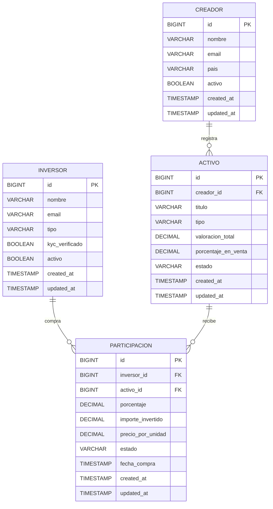

# Mlooker

API REST en **Spring Boot** para el marketplace de **trading de regalías**.  
La plataforma conecta **creadores** que publican activos y **inversores** que compran participaciones para recibir retornos proporcionales.

## Modelo de dominio

### Entidades principales

- **Creador**: artista o titular de derechos que registra activos en la plataforma.
- **Activo**: obra o unidad tokenizable asociada a un creador (catálogo, álbum, canción, etc.).
- **Inversor**: usuario que compra participaciones en activos.
- **Participacion**: entidad puente para modelar la relación N:M entre inversor y activo.

### Relaciones

- `Creador (1) -> (N) Activo`
- `Inversor (N) <-> (M) Activo` mediante `Participacion`

## Diagrama ER (borrador)

## Endpoints CRUD (v1)

Prefijo base: `/api/v1`

### Creadores

| Método | Endpoint | Descripción |
|---|---|---|
| `GET` | `/creadores` | Listar creadores |
| `GET` | `/creadores/{id}` | Obtener creador por ID |
| `POST` | `/creadores` | Crear creador |
| `PUT` | `/creadores/{id}` | Reemplazar creador |
| `PATCH` | `/creadores/{id}` | Actualizar parcialmente creador |
| `DELETE` | `/creadores/{id}` | Eliminar creador |
| `GET` | `/creadores/{id}/activos` | Listar activos de un creador |

### Activos

| Método | Endpoint | Descripción |
|---|---|---|
| `GET` | `/activos` | Listar activos |
| `GET` | `/activos/{id}` | Obtener activo por ID |
| `POST` | `/activos` | Crear activo |
| `POST` | `/creadores/{creadorId}/activos` | Crear activo para un creador |
| `PUT` | `/activos/{id}` | Reemplazar activo |
| `PATCH` | `/activos/{id}` | Actualizar parcialmente activo |
| `DELETE` | `/activos/{id}` | Eliminar activo |
| `GET` | `/activos/{id}/participaciones` | Listar participaciones de un activo |

### Inversores

| Método | Endpoint | Descripción |
|---|---|---|
| `GET` | `/inversores` | Listar inversores |
| `GET` | `/inversores/{id}` | Obtener inversor por ID |
| `POST` | `/inversores` | Crear inversor |
| `PUT` | `/inversores/{id}` | Reemplazar inversor |
| `PATCH` | `/inversores/{id}` | Actualizar parcialmente inversor |
| `DELETE` | `/inversores/{id}` | Eliminar inversor |
| `GET` | `/inversores/{id}/participaciones` | Listar cartera del inversor |

### Participaciones

| Método | Endpoint | Descripción |
|---|---|---|
| `GET` | `/participaciones` | Listar participaciones |
| `GET` | `/participaciones/{id}` | Obtener participación por ID |
| `POST` | `/participaciones` | Registrar compra de participación |
| `POST` | `/inversores/{inversorId}/participaciones` | Comprar en un activo desde inversor |
| `PUT` | `/participaciones/{id}` | Reemplazar participación |
| `PATCH` | `/participaciones/{id}` | Actualizar estado de participación |
| `DELETE` | `/participaciones/{id}` | Eliminar/cancelar participación |

## Diseño de tablas de base de datos

### `creador`

- `id` BIGINT PK AUTO_INCREMENT
- `nombre` VARCHAR(150) NOT NULL
- `email` VARCHAR(255) NOT NULL UNIQUE
- `pais` VARCHAR(2) NULL
- `activo` BOOLEAN NOT NULL DEFAULT TRUE
- `created_at` TIMESTAMP NOT NULL
- `updated_at` TIMESTAMP NOT NULL

### `activo`

- `id` BIGINT PK AUTO_INCREMENT
- `creador_id` BIGINT NOT NULL FK -> `creador.id`
- `titulo` VARCHAR(255) NOT NULL
- `tipo` VARCHAR(50) NOT NULL
- `valoracion_total` DECIMAL(18,2) NOT NULL
- `porcentaje_en_venta` DECIMAL(5,2) NOT NULL
- `estado` VARCHAR(30) NOT NULL
- `created_at` TIMESTAMP NOT NULL
- `updated_at` TIMESTAMP NOT NULL

### `inversor`

- `id` BIGINT PK AUTO_INCREMENT
- `nombre` VARCHAR(150) NOT NULL
- `email` VARCHAR(255) NOT NULL UNIQUE
- `tipo` VARCHAR(30) NOT NULL
- `kyc_verificado` BOOLEAN NOT NULL DEFAULT FALSE
- `activo` BOOLEAN NOT NULL DEFAULT TRUE
- `created_at` TIMESTAMP NOT NULL
- `updated_at` TIMESTAMP NOT NULL

### `participacion`

- `id` BIGINT PK AUTO_INCREMENT
- `inversor_id` BIGINT NOT NULL FK -> `inversor.id`
- `activo_id` BIGINT NOT NULL FK -> `activo.id`
- `porcentaje` DECIMAL(5,2) NOT NULL
- `importe_invertido` DECIMAL(18,2) NOT NULL
- `precio_por_unidad` DECIMAL(18,4) NULL
- `estado` VARCHAR(30) NOT NULL
- `fecha_compra` TIMESTAMP NOT NULL
- `created_at` TIMESTAMP NOT NULL
- `updated_at` TIMESTAMP NOT NULL

Reglas clave sugeridas:

- Índices por FK en `activo.creador_id`, `participacion.inversor_id`, `participacion.activo_id`.
- Validar en capa de negocio que la suma de participaciones activas por activo no supere el límite definido.
