# Documento de diseño — Mlooker


|                   |                                                                                      |
| ----------------- | ------------------------------------------------------------------------------------ |
| **Proyecto**      | Mlooker — Marketplace de regalías musicales                                          |
| **Repositorio**   | [https://github.com/AacostaA-1327/Mlooker](https://github.com/AacostaA-1327/Mlooker) |
| **Autores**       | Alejandro Acosta Arencibia · Damian Perez Alemán                                     |
| **Base de datos** | MySQL 8                                                                              |
| **API**           | Spring Boot — [http://localhost:8080](http://localhost:8080)                         |
| **Frontend**      | React (Vite) — [http://localhost:5173](http://localhost:5173)                        |


---

## 1. Descripción del proyecto

**Mlooker** es una API REST que gestiona un marketplace de música tokenizada:

- Los **creadores** (artistas) publican obras (`activos`).
- Los **inversores** compran fracciones (tokens) de esas obras.
- Los datos se guardan en **MySQL** y se accede mediante capas **Controller → Service → Repository**.

El frontend React consume la misma API para mostrar el marketplace, la wallet y el panel del artista.

---

## 2. Diagrama entidad-relación

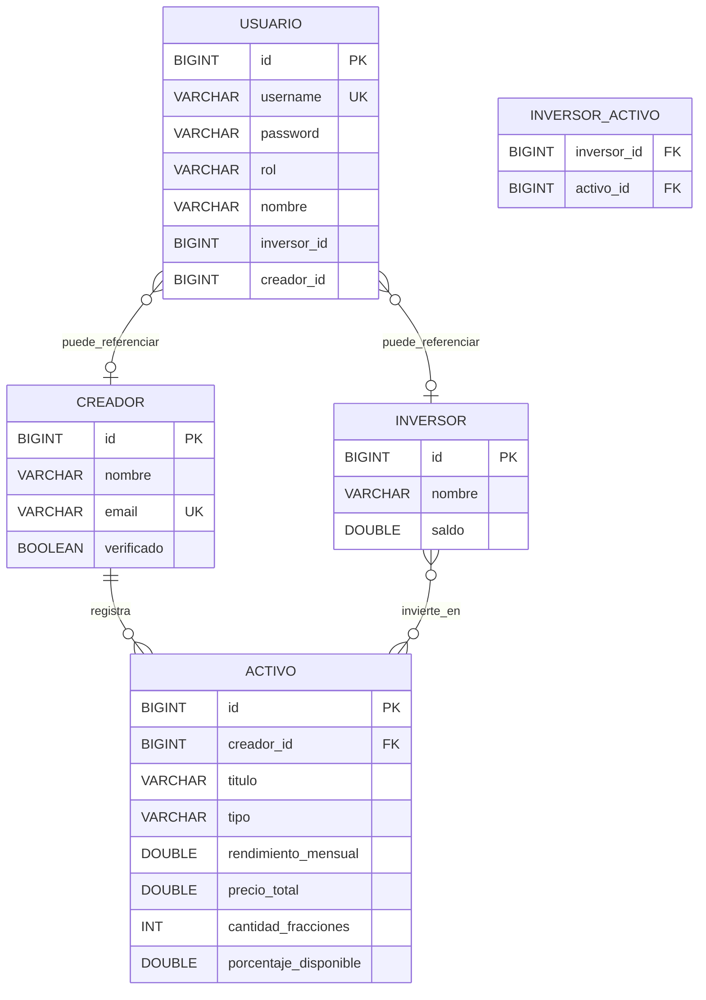

### Relaciones


| Relación                   | Tipo | Cómo está en código                            |
| -------------------------- | ---- | ---------------------------------------------- |
| Creador → Activo           | 1:N  | `@ManyToOne` en `Activo` con `creador_id`      |
| Inversor ↔ Activo          | N:M  | Tabla `inversor_activo` con `@JoinTable`       |
| Usuario → Creador/Inversor | 0..1 | Campos `creadorId` / `inversorId` en `Usuario` |


---

## 3. Base de datos

**Motor:** MySQL 8  
**Nombre de la base de datos:** `mlooker`  
**Se crea sola** al arrancar la API si no existe.

### Tablas


| Tabla             | Clave primaria              | Claves foráneas                          |
| ----------------- | --------------------------- | ---------------------------------------- |
| `creadores`       | `id`                        | —                                        |
| `activos`         | `id`                        | `creador_id` → `creadores.id`            |
| `inversores`      | `id`                        | —                                        |
| `inversor_activo` | `inversor_id` + `activo_id` | → `inversores`, `activos`                |
| `usuarios`        | `id`                        | `inversor_id`, `creador_id` (opcionales) |


---

## 4. Arquitectura

```
Cliente (Postman / React)
        ↓
   Controller   ← recibe HTTP, no toca la BD directamente
        ↓
    Service      ← lógica de negocio
        ↓
   Repository    ← JpaRepository + consultas
        ↓
      MySQL
```

---

## 5. Lista de endpoints

Base: `http://localhost:8080/api/v1`

### Autenticación


| Método | Ruta          | Quién puede | Qué hace                  |
| ------ | ------------- | ----------- | ------------------------- |
| POST   | `/auth/login` | Todos       | Devuelve token JWT        |
| GET    | `/auth/me`    | Con JWT     | Devuelve usuario logueado |


### Creadores


| Método | Ruta                                 | Quién puede        | Qué hace          |
| ------ | ------------------------------------ | ------------------ | ----------------- |
| GET    | `/creadores`                         | Todos              | Lista creadores   |
| GET    | `/creadores/{id}`                    | Todos              | Un creador por ID |
| POST   | `/creadores`                         | Autenticado        | Crea creador      |
| PUT    | `/creadores/{id}`                    | Autenticado        | Actualiza creador |
| DELETE | `/creadores/{id}`                    | Autenticado        | Elimina creador   |
| GET    | `/creadores/{id}/activos`            | Creador (JWT)      | Obras del creador |
| POST   | `/creadores/{id}/activos`            | Creador verificado | Publica obra      |
| PUT    | `/creadores/{id}/activos/{activoId}` | Creador verificado | Edita obra        |
| DELETE | `/creadores/{id}/activos/{activoId}` | Creador verificado | Borra obra        |


### Activos


| Método | Ruta                                       | Quién puede | Qué hace                     |
| ------ | ------------------------------------------ | ----------- | ---------------------------- |
| GET    | `/activos`                                 | Todos       | Lista obras del marketplace  |
| GET    | `/activos/buscar?tipo=&rendimientoMinimo=` | Todos       | Busca con filtros opcionales |
| GET    | `/activos/{id}`                            | Todos       | Detalle de una obra          |
| POST   | `/activos`                                 | Autenticado | Crea activo                  |
| PUT    | `/activos/{id}`                            | Autenticado | Actualiza activo             |
| DELETE | `/activos/{id}`                            | Autenticado | Elimina activo               |


### Inversores


| Método | Ruta                              | Quién puede    | Qué hace              |
| ------ | --------------------------------- | -------------- | --------------------- |
| GET    | `/inversores`                     | Todos          | Lista inversores      |
| GET    | `/inversores/{id}`                | JWT propio     | Datos del inversor    |
| GET    | `/inversores/{id}/regalias-total` | JWT propio     | Total regalías (JPQL) |
| POST   | `/inversores/{id}/invertir`       | Inversor (JWT) | Compra tokens         |
| POST   | `/inversores/{id}/vender`         | Inversor (JWT) | Vende tokens          |
| POST   | `/inversores`                     | Autenticado    | Crea inversor         |
| PUT    | `/inversores/{id}`                | Autenticado    | Actualiza inversor    |
| DELETE | `/inversores/{id}`                | Autenticado    | Elimina inversor      |


### Otros


| Método | Ruta               | Qué hace                      |
| ------ | ------------------ | ----------------------------- |
| GET    | `/health`          | Comprueba que la API funciona |
| GET    | `/swagger-ui.html` | Documentación Swagger         |


---

## 6. Seguridad


| Forma de entrar | Cómo se usa                          | Para qué sirve           |
| --------------- | ------------------------------------ | ------------------------ |
| **JWT**         | `Authorization: Bearer <token>`      | Frontend y usuarios demo |
| **Basic Auth**  | Usuario `admin` / contraseña `admin` | Postman rápido           |
| **API Key**     | Cabecera `X-API-Key: dev-api-key`    | Pruebas con herramientas |


- Los **GET** del marketplace son públicos.
- Los **POST, PUT y DELETE** piden autenticación (si no, devuelven **401**).

---

## 7. Stack tecnológico y decisiones justificadas

### 7.1 Visión general

Mlooker sigue una arquitectura **cliente–servidor** en monorepo: API REST en Java y cliente web en JavaScript. La separación permite desarrollar, desplegar y probar cada capa de forma independiente manteniendo un único repositorio para el equipo.

```
React (Vite)  →  HTTP/JSON  →  Spring Boot  →  JPA/Hibernate  →  MySQL 8
```

### 7.2 Backend — API REST

| Tecnología | Versión | Motivo de elección |
| ---------- | ------- | ------------------ |
| **Java** | 17 | LTS estable; tipado fuerte y ecosistema maduro para APIs empresariales |
| **Spring Boot** | 4.0 | Arranque rápido, autoconfiguración y estándar en el mercado para servicios REST |
| **Spring Web MVC** | (starter) | Expone controladores REST con anotaciones (`@RestController`, `@GetMapping`…) y serialización JSON integrada |
| **Spring Data JPA** | (starter) | Abstrae el acceso a datos con `JpaRepository`; Hibernate genera el esquema y mapea entidades a tablas |
| **Hibernate** | (incluido en JPA) | ORM que materializa relaciones 1:N y N:M (`@ManyToOne`, `@ManyToMany`, `@JoinTable`) sin escribir SQL repetitivo |
| **Spring Security** | (starter) | Centraliza autenticación y autorización; permite combinar JWT, Basic Auth y API Key en un único `SecurityFilterChain` |
| **JJWT** | 0.12.6 | Generación y validación de tokens JWT para el frontend React sin mantener sesión en servidor |
| **Spring Validation** | (starter) | Valida DTOs de entrada con `@Valid`, `@NotBlank`, `@NotNull` antes de llegar a la lógica de negocio |
| **SpringDoc OpenAPI** | 3.0.2 | Documentación interactiva Swagger en `/swagger-ui.html` para probar endpoints sin escribir colecciones a mano |
| **Lombok** | — | Reduce boilerplate en entidades (`@Data`, `@NoArgsConstructor`) y mantiene el código más legible |
| **Maven** | (wrapper) | Gestión de dependencias y build reproducible; `mvnw` evita depender de una instalación global |

### 7.3 Base de datos

| Tecnología | Motivo de elección |
| ---------- | ------------------ |
| **MySQL 8** | Motor relacional real, compartible entre desarrolladores; permite demostrar PK, FK y tablas intermedias en Workbench (no solo en memoria) |
| **Perfil `local` + variables de entorno** | Credenciales fuera del código (`application-local.properties`, `DB_PASSWORD`); el esquema se valida con `ddl-auto=validate` y datos demo se cargan al arrancar |
| **H2** (solo tests) | Base en memoria para pruebas automatizadas sin depender de MySQL en CI |

Se descartó usar H2 como base principal porque no refleja un entorno de producción ni facilita revisar el modelo relacional con herramientas como MySQL Workbench.

### 7.4 Frontend — Cliente web

| Tecnología | Versión | Motivo de elección |
| ---------- | ------- | ------------------ |
| **React** | 19 | Componentes reutilizables para marketplace, wallet y panel creador; amplia documentación y adopción en la industria |
| **Vite** | 6 | Dev server instantáneo (HMR) y build ligero frente a herramientas más pesadas; ideal para un SPA que consume una API |
| **JavaScript (JSX)** | — | Mismo lenguaje en todo el frontend; sin capa extra de TypeScript para un proyecto acotado a consumo de API |
| **Axios** | 1.9 | Cliente HTTP con interceptores: adjunta el JWT automáticamente en cada petición autenticada |
| **Tailwind CSS** | 3.4 | Estilos utilitarios sin mantener hojas CSS grandes; interfaz coherente con poco código |
| **Lucide React** | — | Iconografía ligera y consistente en la UI |
| **Recharts** | 2.15 | Gráficos en la wallet para visualizar rendimiento de la cartera del inversor |

El frontend no duplica lógica de negocio: solo presenta datos y delega validaciones, transacciones y seguridad en la API.

### 7.5 Arquitectura y patrones en la API

| Patrón / práctica | Aplicación | Justificación |
| ----------------- | ---------- | ------------- |
| **Capas Controller → Service → Repository** | Toda la API | Separa HTTP, reglas de negocio y acceso a datos; facilita pruebas y cambios sin acoplar la BD a los endpoints |
| **DTOs de entrada** | `CrearCreadorRequest`, `PublicarActivoRequest`, `LoginRequest` | Desacopla el contrato HTTP de las entidades JPA; evita exponer campos internos y permite validar solo lo necesario |
| **`Optional` en repositorios** | `findById()` en servicios | Fuerza comprobar existencia antes de usar el resultado; si no hay dato, se responde 404 en lugar de lanzar excepciones genéricas |
| **JPQL** | Suma de regalías en `InversorRepository` | Consulta orientada a entidades Java; portable y legible frente a SQL crudo para agregaciones sobre el modelo de dominio |
| **SQL nativo** | Inserciones en `inversor_activo` | Operación puntual sobre tabla intermedia cuando JPA no simplifica el caso de uso |
| **`@JsonIgnore`** | Listas bidireccionales (`Creador.activos`) | Evita referencias circulares que producirían JSON infinito al serializar |
| **`@RestControllerAdvice`** | `ApiExceptionHandler` | Respuestas de error JSON uniformes (`message`, `errors[]`) en lugar del HTML por defecto de Spring |

### 7.6 Seguridad

| Mecanismo | Uso | Justificación |
| --------- | --- | ------------- |
| **JWT (Bearer)** | Frontend React | API stateless; el cliente guarda el token y lo envía en cada petición; escalable y estándar para SPAs |
| **BCrypt** | Contraseñas en `usuarios` | Hash irreversible; Spring Security lo integra con `PasswordEncoder` |
| **HTTP Basic Auth** | Pruebas con `admin` / `admin` | Alternativa rápida en Postman sin flujo de login |
| **API Key (`X-API-Key`)** | Herramientas y scripts | Autenticación simple para escritura en entornos de desarrollo sin implementar OAuth |
| **Autorización por roles** | `INVERSOR`, `CREADOR` | Restringe invertir, vender y gestionar obras más allá de “estar autenticado” |
| **Reglas por método HTTP** | GET públicos en marketplace; POST/PUT/DELETE protegidos | Lectura abierta para explorar el catálogo; mutaciones siempre autenticadas |

### 7.7 Herramientas de desarrollo y documentación

| Herramienta | Rol |
| ----------- | --- |
| **MySQL Workbench** | Inspección de tablas, PK/FK y datos de demo |
| **Postman** | Pruebas de endpoints, búsqueda con filtros y evidencias de seguridad (401, login JWT) |
| **Swagger UI** | Contrato vivo de la API generado desde el código |
| **Git + GitHub** | Control de versiones y trabajo en equipo sobre el monorepo |


---

## 8. Alcance funcional


| Área            | Implementación                                                                                                   |
| --------------- | ---------------------------------------------------------------------------------------------------------------- |
| Modelo de datos | Entidades JPA (`Creador`, `Activo`, `Inversor`, `Usuario`), persistencia en MySQL                                |
| Relaciones      | 1:N entre creador y activo; N:M entre inversor y activo vía `inversor_activo`                                    |
| API REST        | CRUD completo, capas Controller → Service → Repository, manejo de `Optional`                                     |
| Consultas       | Búsqueda de activos con query params; cálculo de regalías con JPQL                                               |
| Seguridad       | JWT para el frontend, Basic Auth y API Key para integración; validación con DTOs y respuestas de error uniformes |
| Cliente web     | Marketplace público, wallet del inversor y panel del creador sobre la misma API                                  |


---

## 9. Evidencias — capturas de pantalla

Evidencias del sistema en funcionamiento. Archivos en `docs/capturas/`.

### Índice de capturas


| #   | Qué demuestra                          | Archivo                   |
| --- | -------------------------------------- | ------------------------- |
| 1   | Tabla `creadores`                      | `creadores.png`           |
| 2   | Tabla `activos` con FK `creador_id`    | `activos.png`             |
| 3   | Tabla `inversores`                     | `inversores.png`          |
| 4   | Tabla `inversor_activo` (N:M)          | `inversor_activo.png`     |
| 5   | Tabla `usuarios` y roles               | `usuarios.png`            |
| 6   | GET público `/activos` (sin login)     | `postman-get-activos.png` |
| 7a  | Búsqueda sin filtros                   | `postman-buscar1.png`     |
| 7b  | Búsqueda `tipo=MUSICA`                 | `postman-buscar2.png`     |
| 7c  | Búsqueda tipo + `rendimientoMinimo=10` | `postman-buscar3.png`     |
| 8   | POST sin auth → 401                    | `postman-401.png`         |
| 9   | Login JWT → token                      | `postman-login.png`       |


---

### 9.1 Base de datos (MySQL Workbench)

**Captura 1 — Tabla `creadores`**

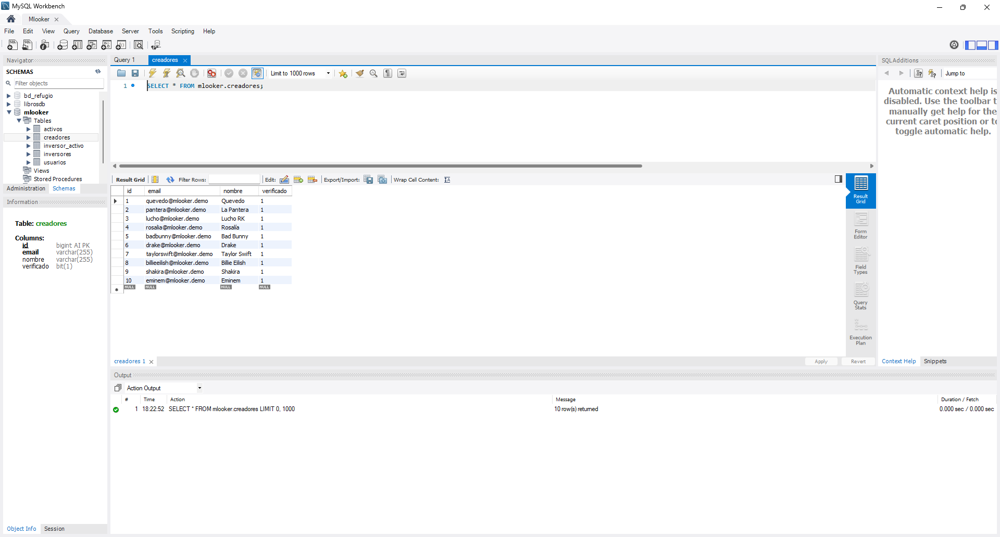

**Captura 2 — Tabla `activos` (FK `creador_id`)**

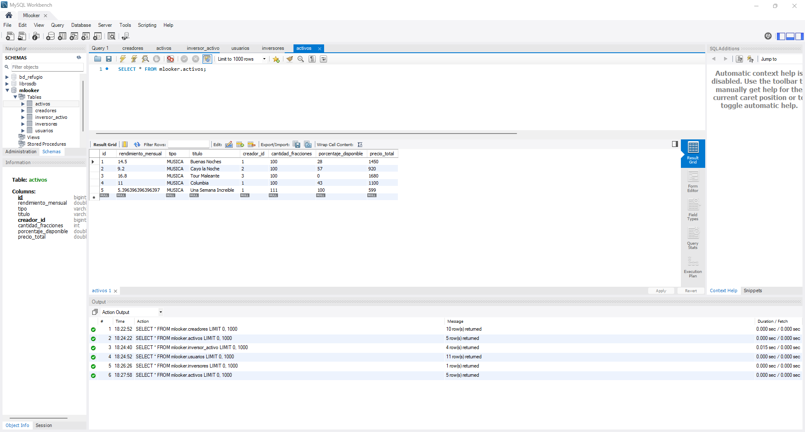

**Captura 3 — Tabla `inversores`**

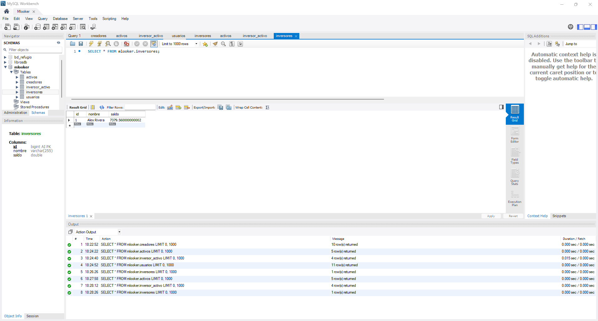

**Captura 4 — Tabla `inversor_activo` (relación N:M)**

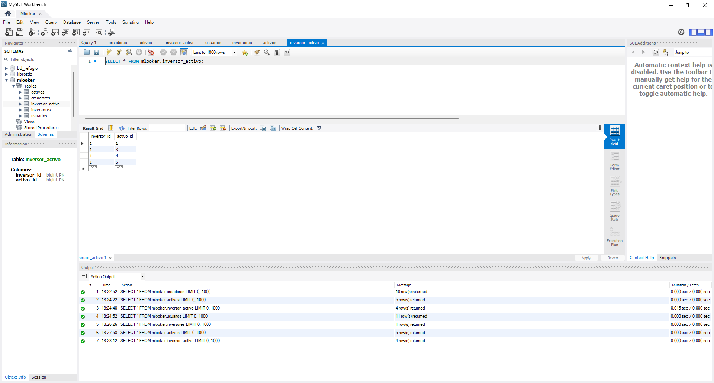

**Captura 5 — Tabla `usuarios`**

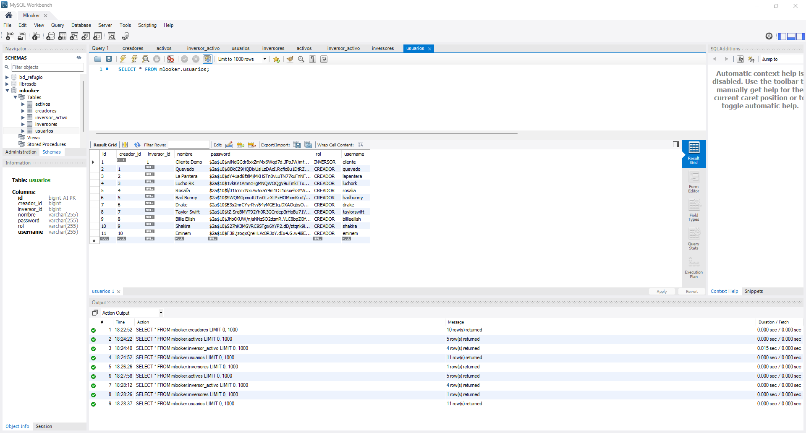

---

### 9.2 API — Marketplace y búsqueda

**Captura 6 — GET `/activos` sin autenticación**

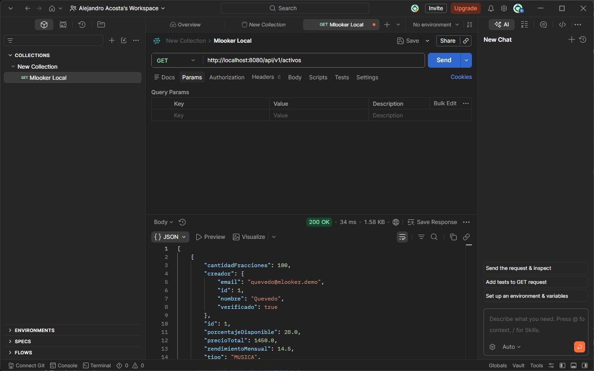

**Captura 7 — Búsqueda con filtros**

Sin filtros:

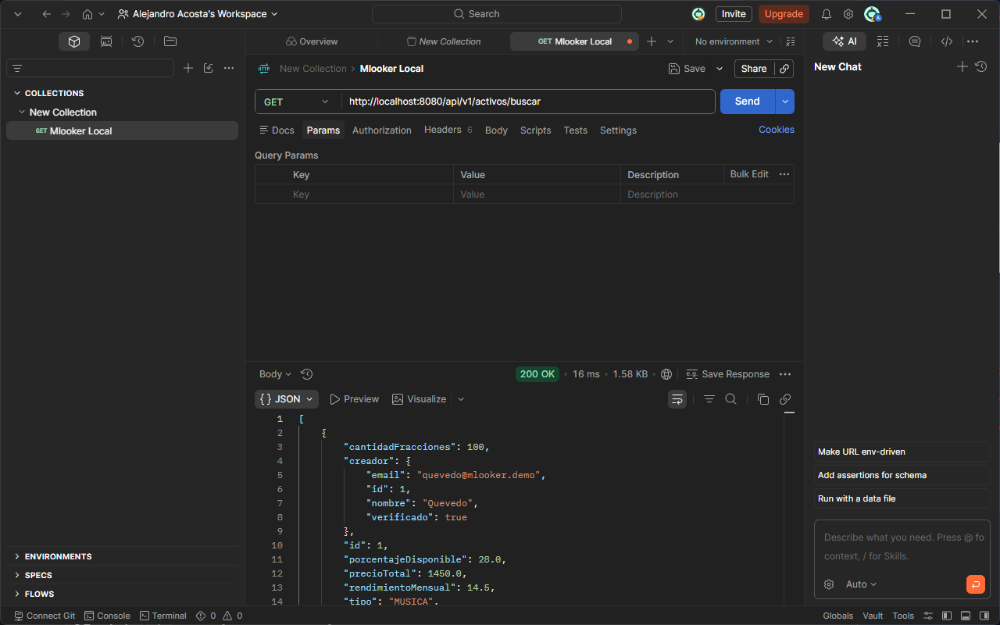

Solo `tipo=MUSICA`:

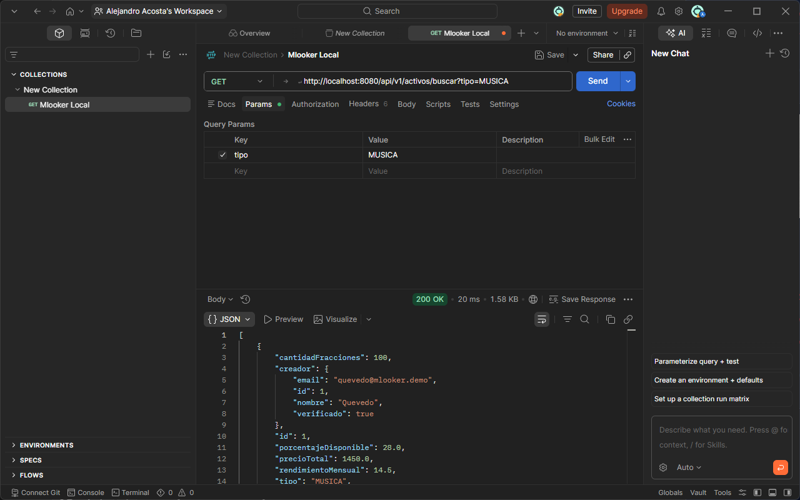

`tipo=MUSICA` y `rendimientoMinimo=10`:

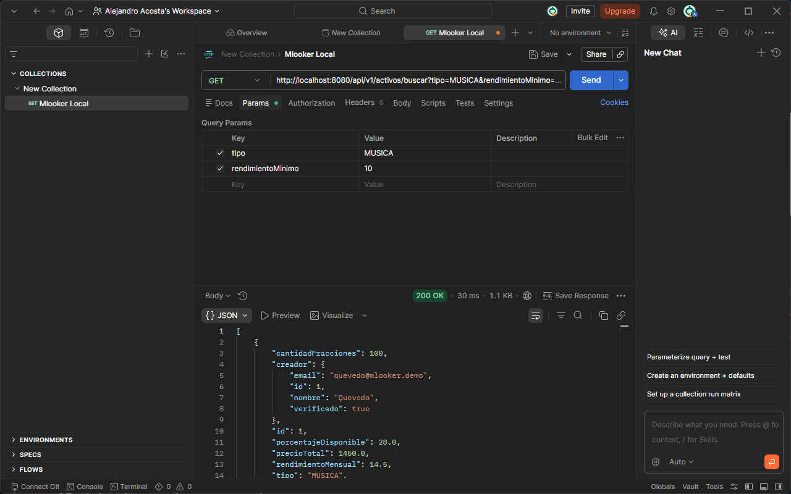

---

### 9.3 Seguridad y autenticación

**Captura 8 — POST sin login → 401 Unauthorized**

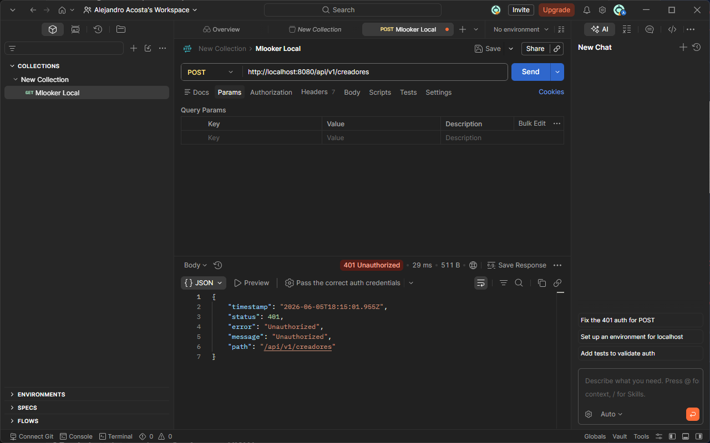

**Captura 9 — Login JWT**

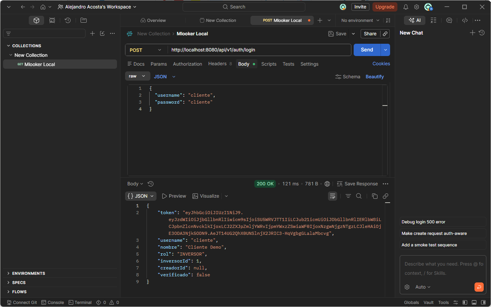

---

## 10. Reparto de trabajo


| Persona                    | Responsabilidades                                                                                               |
| -------------------------- | --------------------------------------------------------------------------------------------------------------- |
| Alejandro Acosta Arencibia | Arquitectura de la API, autenticación JWT, frontend React, integración cliente–servidor, documentación y merges |
| Damian                     | Endpoint de búsqueda con query params, capa de repositorios y servicios asociados                               |


---

## 11. Documentación del repositorio


| Recurso              | Ubicación                               | Contenido                                               |
| -------------------- | --------------------------------------- | ------------------------------------------------------- |
| Documento de diseño  | `docs/documento-diseno.md`              | Este documento                                          |
| Capturas de pantalla | `docs/capturas/`                        | Evidencias de base de datos, API y seguridad            |
| Diagrama ER          | `docs/er-diagrama-mlooker.md`           | Esquema detallado alineado con las entidades JPA        |
| Guía de instalación  | `docs/SETUP-LOCAL.md`                   | Arranque de MySQL, API y frontend en local              |
| API en vivo          | `http://localhost:8080/swagger-ui.html` | Contratos y pruebas de endpoints (con la API en marcha) |
| Visión general       | `README.md`                             | Descripción del proyecto, endpoints y usuarios de demo  |


---

*Mlooker — Documento de diseño*