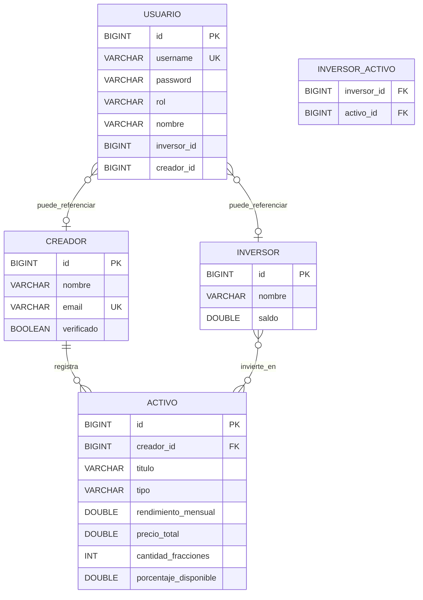

# Documento de diseño — Mlooker


|                   |                                                                                      |
| ----------------- | ------------------------------------------------------------------------------------ |
| **Proyecto**      | Mlooker — Marketplace de regalías musicales                                          |
| **Repositorio**   | [https://github.com/AacostaA-1327/Mlooker](https://github.com/AacostaA-1327/Mlooker) |
| **Autores**       | Alejandro Acosta Arencibia · Damian Perez Alemán                                     |
| **Base de datos** | MySQL 8                                                                              |
| **API**           | Spring Boot — [http://localhost:8080](http://localhost:8080)                         |
| **Frontend**      | React (Vite) — [http://localhost:5173](http://localhost:5173)                        |


---

## 1. Descripción del proyecto

**Mlooker** es una API REST que gestiona un marketplace de música tokenizada:

- Los **creadores** (artistas) publican obras (`activos`).
- Los **inversores** compran fracciones (tokens) de esas obras.
- Los datos se guardan en **MySQL** y se accede mediante capas **Controller → Service → Repository**.

El frontend React consume la misma API para mostrar el marketplace, la wallet y el panel del artista.

---

## 2. Diagrama entidad-relación



### Relaciones


| Relación                   | Tipo | Cómo está en código                            |
| -------------------------- | ---- | ---------------------------------------------- |
| Creador → Activo           | 1:N  | `@ManyToOne` en `Activo` con `creador_id`      |
| Inversor ↔ Activo          | N:M  | Tabla `inversor_activo` con `@JoinTable`       |
| Usuario → Creador/Inversor | 0..1 | Campos `creadorId` / `inversorId` en `Usuario` |


---

## 3. Base de datos

**Motor:** MySQL 8  
**Nombre de la base de datos:** `mlooker`  
**Se crea sola** al arrancar la API si no existe.

### Tablas


| Tabla             | Clave primaria              | Claves foráneas                          |
| ----------------- | --------------------------- | ---------------------------------------- |
| `creadores`       | `id`                        | —                                        |
| `activos`         | `id`                        | `creador_id` → `creadores.id`            |
| `inversores`      | `id`                        | —                                        |
| `inversor_activo` | `inversor_id` + `activo_id` | → `inversores`, `activos`                |
| `usuarios`        | `id`                        | `inversor_id`, `creador_id` (opcionales) |


---

## 4. Arquitectura

```
Cliente (Postman / React)
        ↓
   Controller   ← recibe HTTP, no toca la BD directamente
        ↓
    Service      ← lógica de negocio
        ↓
   Repository    ← JpaRepository + consultas
        ↓
      MySQL
```

---

## 5. Lista de endpoints

Base: `http://localhost:8080/api/v1`

### Autenticación


| Método | Ruta          | Quién puede | Qué hace                  |
| ------ | ------------- | ----------- | ------------------------- |
| POST   | `/auth/login` | Todos       | Devuelve token JWT        |
| GET    | `/auth/me`    | Con JWT     | Devuelve usuario logueado |


### Creadores


| Método | Ruta                                 | Quién puede        | Qué hace          |
| ------ | ------------------------------------ | ------------------ | ----------------- |
| GET    | `/creadores`                         | Todos              | Lista creadores   |
| GET    | `/creadores/{id}`                    | Todos              | Un creador por ID |
| POST   | `/creadores`                         | Autenticado        | Crea creador      |
| PUT    | `/creadores/{id}`                    | Autenticado        | Actualiza creador |
| DELETE | `/creadores/{id}`                    | Autenticado        | Elimina creador   |
| GET    | `/creadores/{id}/activos`            | Creador (JWT)      | Obras del creador |
| POST   | `/creadores/{id}/activos`            | Creador verificado | Publica obra      |
| PUT    | `/creadores/{id}/activos/{activoId}` | Creador verificado | Edita obra        |
| DELETE | `/creadores/{id}/activos/{activoId}` | Creador verificado | Borra obra        |


### Activos


| Método | Ruta                                       | Quién puede | Qué hace                     |
| ------ | ------------------------------------------ | ----------- | ---------------------------- |
| GET    | `/activos`                                 | Todos       | Lista obras del marketplace  |
| GET    | `/activos/buscar?tipo=&rendimientoMinimo=` | Todos       | Busca con filtros opcionales |
| GET    | `/activos/{id}`                            | Todos       | Detalle de una obra          |
| POST   | `/activos`                                 | Autenticado | Crea activo                  |
| PUT    | `/activos/{id}`                            | Autenticado | Actualiza activo             |
| DELETE | `/activos/{id}`                            | Autenticado | Elimina activo               |


### Inversores


| Método | Ruta                              | Quién puede    | Qué hace              |
| ------ | --------------------------------- | -------------- | --------------------- |
| GET    | `/inversores`                     | Todos          | Lista inversores      |
| GET    | `/inversores/{id}`                | JWT propio     | Datos del inversor    |
| GET    | `/inversores/{id}/regalias-total` | JWT propio     | Total regalías (JPQL) |
| POST   | `/inversores/{id}/invertir`       | Inversor (JWT) | Compra tokens         |
| POST   | `/inversores/{id}/vender`         | Inversor (JWT) | Vende tokens          |
| POST   | `/inversores`                     | Autenticado    | Crea inversor         |
| PUT    | `/inversores/{id}`                | Autenticado    | Actualiza inversor    |
| DELETE | `/inversores/{id}`                | Autenticado    | Elimina inversor      |


### Otros


| Método | Ruta               | Qué hace                      |
| ------ | ------------------ | ----------------------------- |
| GET    | `/health`          | Comprueba que la API funciona |
| GET    | `/swagger-ui.html` | Documentación Swagger         |


---

## 6. Seguridad


| Forma de entrar | Cómo se usa                          | Para qué sirve           |
| --------------- | ------------------------------------ | ------------------------ |
| **JWT**         | `Authorization: Bearer <token>`      | Frontend y usuarios demo |
| **Basic Auth**  | Usuario `admin` / contraseña `admin` | Postman rápido           |
| **API Key**     | Cabecera `X-API-Key: dev-api-key`    | Pruebas con herramientas |


- Los **GET** del marketplace son públicos.
- Los **POST, PUT y DELETE** piden autenticación (si no, devuelven **401**).

---

## 7. Decisiones técnicas


| Tema                    | Decisión                                  | Por qué                                              |
| ----------------------- | ----------------------------------------- | ---------------------------------------------------- |
| `@JsonIgnore`           | En listas como `Creador.activos`          | Evita JSON infinito al serializar                    |
| `Optional`              | En `findById()`                           | No usar `.get()` a ciegas; devolver 404 si no existe |
| JPQL                    | `SUM` de regalías en `InversorRepository` | Consulta sobre entidades Java, no tablas SQL         |
| SQL nativo              | `INSERT` en `inversor_activo`             | Operación directa en tabla intermedia                |
| `@Valid` + DTOs         | En crear creador y publicar obra          | Errores claros por campo                             |
| `@RestControllerAdvice` | `ApiExceptionHandler`                     | Errores JSON uniformes                               |
| MySQL                   | En lugar de H2                            | Persistencia real y trabajo en equipo                |


---

## 8. Alcance funcional


| Área            | Implementación                                                                                                   |
| --------------- | ---------------------------------------------------------------------------------------------------------------- |
| Modelo de datos | Entidades JPA (`Creador`, `Activo`, `Inversor`, `Usuario`), persistencia en MySQL                                |
| Relaciones      | 1:N entre creador y activo; N:M entre inversor y activo vía `inversor_activo`                                    |
| API REST        | CRUD completo, capas Controller → Service → Repository, manejo de `Optional`                                     |
| Consultas       | Búsqueda de activos con query params; cálculo de regalías con JPQL                                               |
| Seguridad       | JWT para el frontend, Basic Auth y API Key para integración; validación con DTOs y respuestas de error uniformes |
| Cliente web     | Marketplace público, wallet del inversor y panel del creador sobre la misma API                                  |


---

## 9. Evidencias — capturas de pantalla

Evidencias del sistema en funcionamiento. Los archivos originales están en `docs/capturas/`; a continuación se incluyen embebidos en este documento.

### Índice de capturas


| #   | Qué demuestra                          | Archivo                   |
| --- | -------------------------------------- | ------------------------- |
| 1   | Tabla `creadores`                      | `creadores.png`           |
| 2   | Tabla `activos` con FK `creador_id`    | `activos.png`             |
| 3   | Tabla `inversores`                     | `inversores.png`          |
| 4   | Tabla `inversor_activo` (N:M)          | `inversor_activo.png`     |
| 5   | Tabla `usuarios` y roles               | `usuarios.png`            |
| 6   | GET público `/activos` (sin login)     | `postman-get-activos.png` |
| 7a  | Búsqueda sin filtros                   | `postman-buscar1.png`     |
| 7b  | Búsqueda `tipo=MUSICA`                 | `postman-buscar2.png`     |
| 7c  | Búsqueda tipo + `rendimientoMinimo=10` | `postman-buscar3.png`     |
| 8   | POST sin auth → 401                    | `postman-401.png`         |
| 9   | Login JWT → token                      | `postman-login.png`       |


---

### 9.1 Base de datos (MySQL Workbench)

#### Captura 1 — Tabla `creadores`

Captura 1 - tabla creadores

#### Captura 2 — Tabla `activos` (FK `creador_id`)

Captura 2 - tabla activos

#### Captura 3 — Tabla `inversores`

Captura 3 - tabla inversores

#### Captura 4 — Tabla `inversor_activo` (relación N:M)

Captura 4 - tabla inversor_activo

#### Captura 5 — Tabla `usuarios`

Captura 5 - tabla usuarios

---

### 9.2 API — Marketplace y búsqueda

#### Captura 6 — GET `/activos` sin autenticación

Captura 6 - GET activos

#### Captura 7 — Búsqueda con filtros

Sin filtros:

Captura 7a - buscar sin filtros

Solo `tipo=MUSICA`:

Captura 7b - buscar tipo MUSICA

`tipo=MUSICA` y `rendimientoMinimo=10`:

Captura 7c - buscar tipo y rendimiento

---

### 9.3 Seguridad y autenticación

#### Captura 8 — POST sin login → 401 Unauthorized

Captura 8 - 401 sin auth

#### Captura 9 — Login JWT

Captura 9 - login JWT

---

## 10. Reparto de trabajo


| Persona                    | Responsabilidades                                                                                               |
| -------------------------- | --------------------------------------------------------------------------------------------------------------- |
| Alejandro Acosta Arencibia | Arquitectura de la API, autenticación JWT, frontend React, integración cliente–servidor, documentación y merges |
| Damian                     | Endpoint de búsqueda con query params, capa de repositorios y servicios asociados                               |


---

## 11. Documentación del repositorio


| Recurso              | Ubicación                               | Contenido                                               |
| -------------------- | --------------------------------------- | ------------------------------------------------------- |
| Documento de diseño  | `docs/documento-diseno.md`              | Este documento                                          |
| Capturas de pantalla | `docs/capturas/`                        | Evidencias de base de datos, API y seguridad            |
| Diagrama ER          | `docs/er-diagrama-mlooker.md`           | Esquema detallado alineado con las entidades JPA        |
| Guía de instalación  | `docs/SETUP-LOCAL.md`                   | Arranque de MySQL, API y frontend en local              |
| API en vivo          | `http://localhost:8080/swagger-ui.html` | Contratos y pruebas de endpoints (con la API en marcha) |
| Visión general       | `README.md`                             | Descripción del proyecto, endpoints y usuarios de demo  |


---

*Mlooker — Documento de diseño*