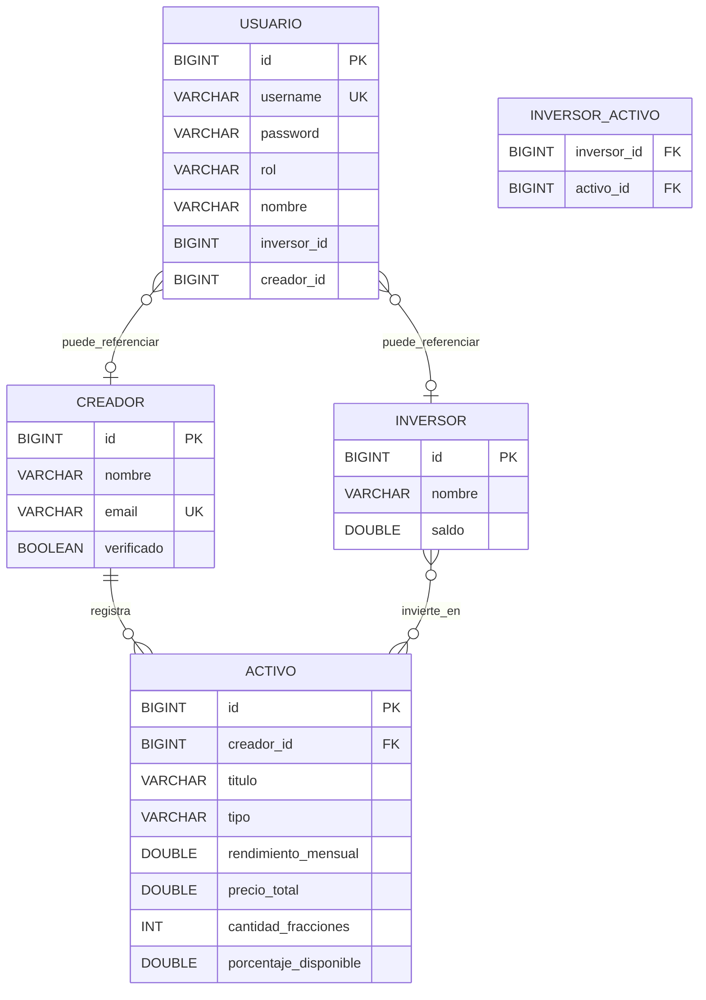

# Diagrama ER — Mlooker

Esquema alineado con las entidades JPA del proyecto (rama KAN-20).

## Relaciones

| Relación | Cardinalidad | Implementación |
|----------|--------------|----------------|
| Creador → Activo | 1:N | `@ManyToOne` en `Activo`, `@OneToMany` en `Creador` |
| Inversor ↔ Activo | N:M | Tabla `inversor_activo` con `@JoinTable` |
| Usuario → Creador / Inversor | 0..1 | Campos `creadorId` / `inversorId` en `usuarios` |

## Notas

- La relación N:M modela la **cartera** del inversor; el importe y tokens poseídos en la demo web se gestionan también en `localStorage` hasta persistir transacciones.
- `verificado` en `creadores` controla quién puede usar el panel de publicación.
- Tipos de activo válidos: `MUSICA`, `ALBUM`.
