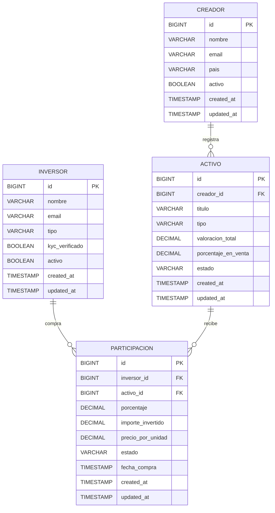

# Diagrama ER - Mlooker (Borrador Inicial)

## Notas de diseño

- Relacion principal de negocio:
  - `Creador 1:N Activo`
  - `Inversor N:M Activo` mediante `Participacion`
- `Participacion` permite trazabilidad de compras escalonadas y estado de ciclo de vida (`PENDIENTE`, `ACTIVA`, `CANCELADA`, `LIQUIDADA`).
- La logica de limites de participacion debe validarse en servicio de dominio.
